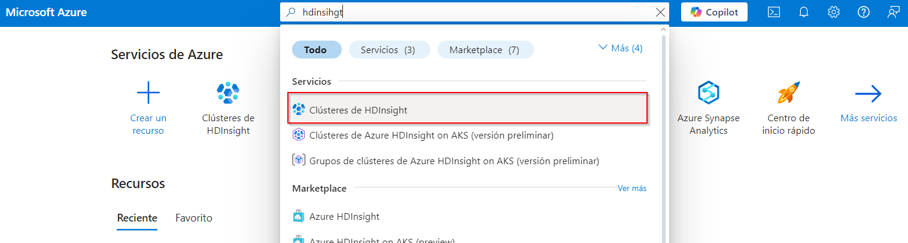
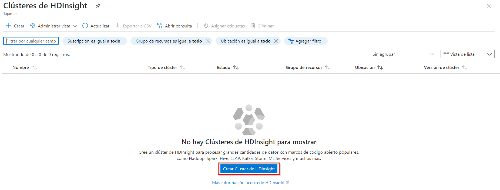
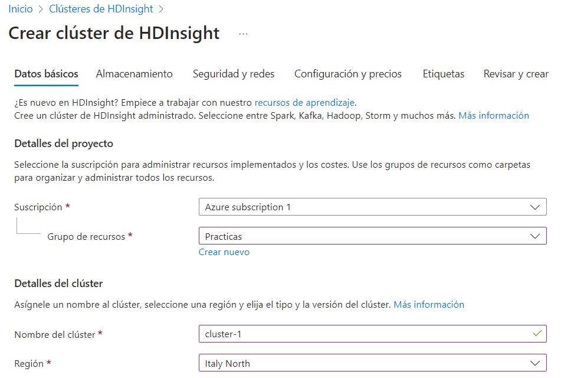
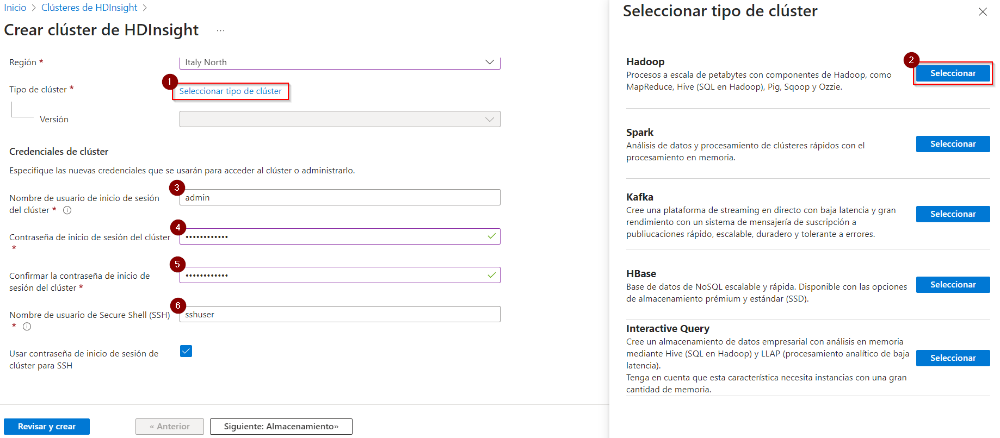
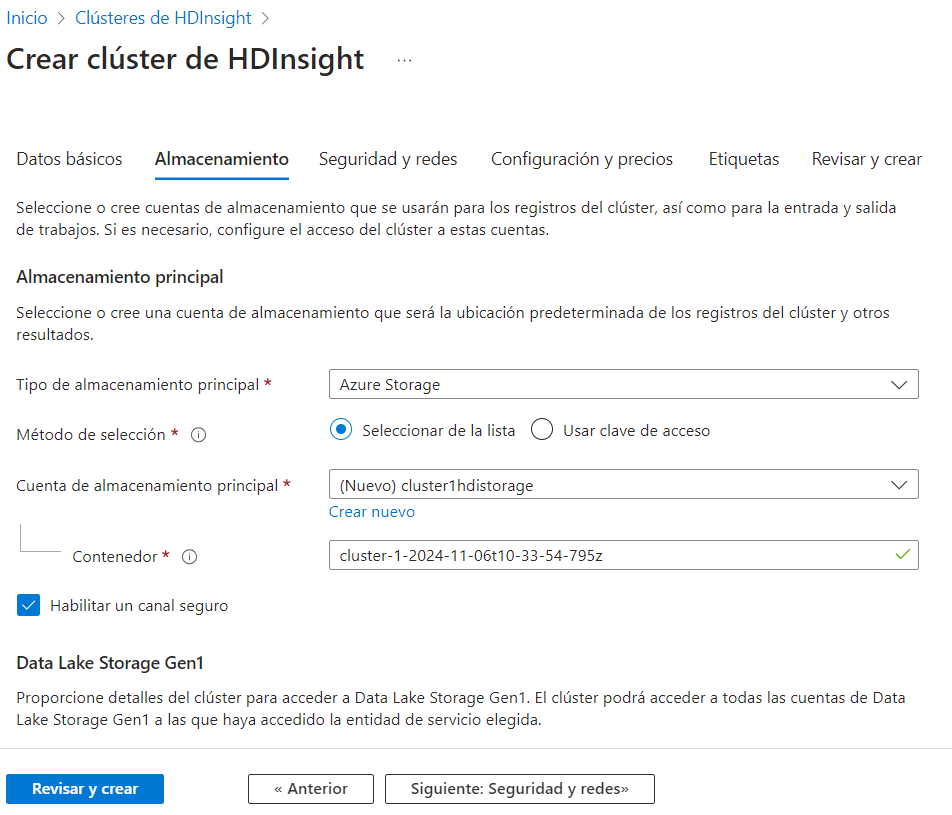

# Creación de un clúster de Apache Hadoop utilizando Azure HDInsight

**Fuentes**:

[Quickstart: Apache Hadoop, Apache Hive & Azure HDInsight portal | Microsoft Learn](https://learn.microsoft.com/en-us/azure/hdinsight/hadoop/apache-hadoop-linux-create-cluster-get-started-portal)

[Tutorial: ETL operations with Interactive Query - Azure HDInsight | Microsoft Learn](https://learn.microsoft.com/en-us/azure/hdinsight/interactive-query/interactive-query-tutorial-analyze-flight-data)

**Índice de contenidos**:

- [Creación de un clúster de Apache Hadoop utilizando Azure HDInsight](#creación-de-un-clúster-de-apache-hadoop-utilizando-azure-hdinsight)
  - [Crear un clúster de Hadoop en HDInsight](#crear-un-clúster-de-hadoop-en-hdinsight)
    - [Configurar el clúster](#configurar-el-clúster)
      - [Datos básicos](#datos-básicos)
      - [Almacenamiento](#almacenamiento)
      - [Revisar y crear](#revisar-y-crear)

## Crear un clúster de Hadoop en HDInsight

1 - Iniciar sesión en el **portal de Azure**.

2 - En la barra de búsqueda superior, introducirr "**hdinsight**".

3 - Seleccionar "**Clústeres de HDInsight**".

4 - Hacer click en "**Crear Clúster de HDInsight**":

### Configurar el clúster

#### Datos básicos

| Propiedad                             | Descripción                                                                                                                                                                  |
|---------------------------------------|------------------------------------------------------------------------------------------------------------------------------------------------------------------------------|
| **Suscripción**                       | Seleccionar la suscripción de Azure que se usará para el clúster.                                                                                                           |
| **Grupo de recursos**                 | Seleccionar un grupo de recursos existente o crear uno nuevo.                                                                                                               |
| **Nombre del clúster**                | Ingresar un nombre único globalmente.    |
| **Región**                             | Seleccionar la región donde se creará el clúster. Elegir una ubicación cercana para mejorar el rendimiento.                                                                 |
| **Tipo de clúster**                   | Seleccionar **Hadoop** como tipo de clúster.                                                                                                                                |
| **Versión**                            | Seleccionar una versión. Usar la versión predeterminada si no se sabe cuál elegir.                                                                                           |
| **Nombre de usuario y contraseña de inicio de sesión del clúster** | El nombre de usuario predeterminado es **admin**. La contraseña debe tener al menos 10 caracteres e incluir al menos un dígito, una letra mayúscula, una minúscula, y un carácter no alfanumérico (excepto los caracteres ' ` "). Evitar contraseñas comunes como "Pass@word1". |
| **Nombre de usuario SSH**             | El nombre de usuario predeterminado es **sshuser**. Se puede proporcionar otro nombre.                                                                                      |
| **Usar la misma contraseña para SSH que para el usuario del clúster** | Seleccionar esta casilla para usar la misma contraseña para el usuario SSH que la proporcionada para el usuario del clúster.                                                 |

#### Almacenamiento

| Propiedad                     | Descripción                                                                                                                                                                                |
|-------------------------------|--------------------------------------------------------------------------------------------------------------------------------------------------------------------------------------------|
| **Tipo de almacenamiento principal** | Usar el valor predeterminado **Azure Storage**.                                                                                                                                               |
| **Método de selección**        | Usar el valor predeterminado **Seleccionar de la lista**.                                                                                                                                   |
| **Cuenta de almacenamiento principal** | Usar la lista desplegable para seleccionar una cuenta de almacenamiento existente o seleccionar **Crear nueva**. Si se crea una nueva cuenta, el nombre debe tener entre 3 y 24 caracteres, e incluir solo números y letras minúsculas. |
| **Contenedor**                 | Usar el valor autocompletado.                                                                                                                                                               |

#### Revisar y crear

